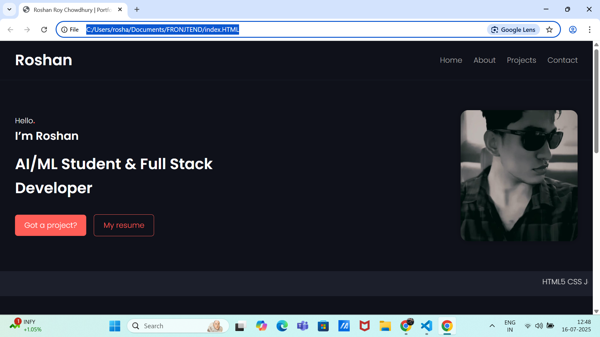

# 🌐 Roshan Roy Chowdhury | Portfolio Website

Welcome to my personal portfolio website built using **HTML**, **CSS**, and **JavaScript**.  
This site serves as a showcase of my skills, projects, and contact details.

---

## 🚀 Features

- 💼 About Me section
- 🛠️ Projects display
- 📞 Contact section with email, GitHub & LinkedIn
- 🖼️ Profile image
- 🎨 Clean and responsive UI
- 💡 Built with pure HTML, CSS, and JavaScript

---

## 🛠️ Technologies Used

- HTML5  
- CSS3  
- JavaScript  
- Google Fonts

---

## 📸 Preview



---

## 📂 How to Run Locally

1. Clone this repository:
   ```bash
   git clone https://github.com/shan961/portfolio.git